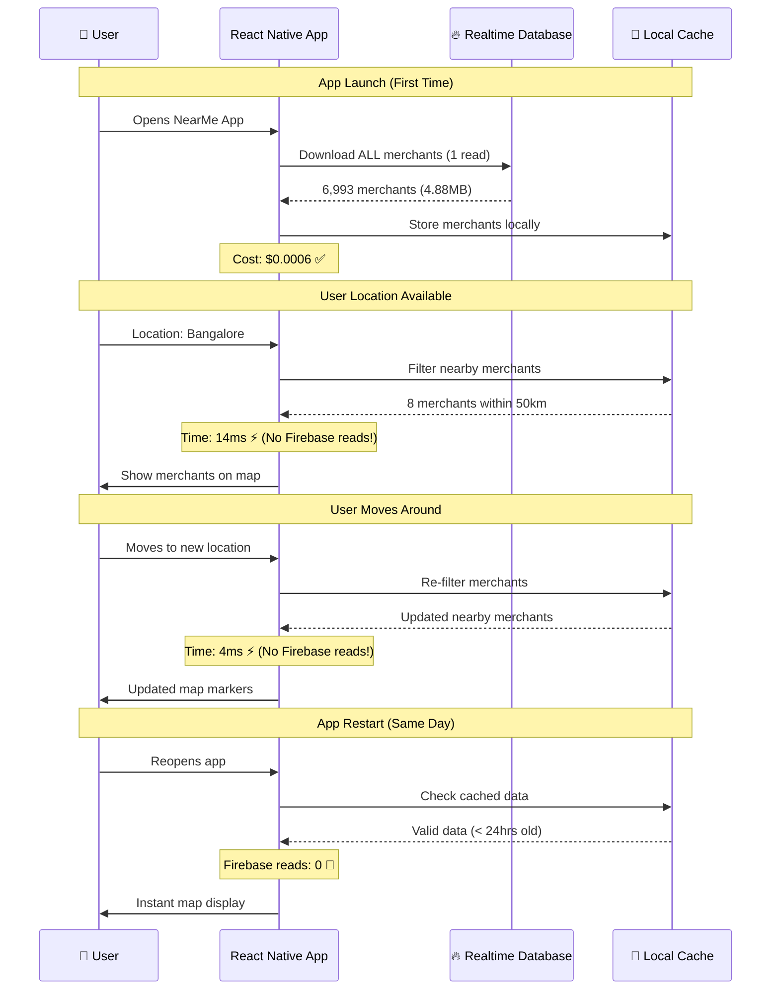

# NearMe - Solana Mobile Payment dApp

A React Native mobile application that enables crypto payments at local merchants using Solana blockchain technology. Built for the Solana Mobile Hackathon.

## 🚀 Features

- **Interactive Map**: Discover crypto-accepting merchants in Bangalore
- **Solana Payments**: Pay with SOL or USDC using Mobile Wallet Adapter
- **Real-time Conversion**: Live SOL/USDC to USD exchange rates
- **Rewards System**: Earn 1% cashback in SOL for all payments
- **NFT Badges**: Collect achievement-based NFT rewards
- **Dark Theme**: Professional Solana-branded UI

## 📱 Platform Support

**⚠️ ANDROID ONLY**: This app is currently configured for Android devices only. Do not attempt to run the iOS version as it is not supported and will cause build errors.

## 🛠️ Tech Stack

- **React Native** with Expo (Development Build)
- **TypeScript** for type safety
- **Solana Web3.js** for blockchain interactions
- **Solana Pay** for standardized payment processing
- **Mobile Wallet Adapter** for native wallet integration
- **React Native Maps** for merchant discovery
- **React Navigation** for screen management
- **Firebase Realtime Database** for optimized merchant data (98%+ cost savings)

## 🏗️ Architecture: Optimized Data Flow

Our app uses Firebase Realtime Database for ultra-efficient merchant data access:



### 🚀 Performance Benefits:

| Metric | Old Firestore | New Realtime DB | Improvement |
|--------|---------------|-----------------|-------------|
| **Firebase Reads** | 6,993 per session | 1 per session | **99.98%** ↓ |
| **Cost per User** | $0.251748 | $0.0006 | **99.8%** ↓ |
| **Initial Load** | Multiple requests | 1.5 seconds | **Consistent** |
| **Filtering** | Server queries | 14ms client-side | **Instant** ⚡ |
| **Offline Support** | No | Yes | **New feature** |

## 📱 Prerequisites

- Node.js 18+ and npm
- Android Studio with Android SDK
- Expo CLI: `npm install -g @expo/cli`
- Android emulator or physical device
- Solana-compatible mobile wallet (Phantom, Solflare, etc.)

## 🔧 Setup Instructions

### 1. Clone and Install

```bash
git clone https://github.com/bluntbrain/solana-near-me.git
cd solana-near-me
npm install
```

**Note:** After cloning, make sure to install the latest dependencies including Solana Pay:
```bash
npm install @solana/pay @solana/spl-token bignumber.js react-native-qrcode-svg react-native-svg
```

### 2. Google Maps API Key Setup

1. Get a Google Maps API key from [Google Cloud Console](https://console.cloud.google.com/)
2. Enable the following APIs:
   - Maps SDK for Android
   - Maps SDK for iOS
   - Places API

3. Set up the API key:

**For Development:**
Replace `${GOOGLE_MAPS_API_KEY}` in the following files with your actual API key:
- `android/app/src/main/AndroidManifest.xml`
- `app.json`

**For Production:**
Use environment variables or secure key management.

### 3. Development Build Setup (REQUIRED)

**⚠️ IMPORTANT**: This app uses native modules (Solana Mobile Wallet Adapter, React Native Maps, Firebase) that require a development build. You cannot use Expo Go.

#### Option A: Build Development Build Locally (Recommended)

```bash
# Install EAS CLI
npm install -g @expo/eas-cli

# Login to Expo
npx eas login

# Configure EAS (if not already done)
npx eas build:configure

# Build development build for Android
npx eas build --profile development --platform android
```

After the build completes:
1. Download the APK from the Expo dashboard
2. Install it on your Android device or emulator
3. The development build will have "NearMe (dev)" name

#### Option B: Local Development Build (Faster for development)

```bash
# Generate native directories (if not already done)
npx expo prebuild

# Build and install development build locally
npx expo run:android --device
```

### 4. Running the App

Once you have the development build installed:

```bash
# Start the development server
npx expo start --dev-client

# Or if you want to clear cache
npx expo start --dev-client --clear
```

**Important**: 
- Make sure to scan the QR code with the development build app (not Expo Go)
- The development build app icon will show "NearMe (dev)" or similar

## 🔨 Build & Install Commands

### Quick Commands

```bash
# 🚀 One-command build and install (Recommended)
npm run quick-build

# 📱 Build and install with options
npm run build-and-install

# 🔄 Rebuild after Firebase changes
npm run prebuild && npm run quick-build
```

### Manual Build Process

```bash
# 1. Clean build (if needed)
npm run clean
npm run clean:android

# 2. Generate native code
npm run prebuild

# 3. Build APK
npm run build:android

# 4. Install on emulator/device
npm run install:debug
```

### Advanced Build Options

```bash
# Development builds with EAS
npm run build:dev          # Local development build
npm run build:dev-cloud     # Cloud development build

# Preview/Production builds
npm run build:preview       # Preview build
npm run build:production    # Production build

# Install options
npm run install:emulator    # Install on emulator
npm run install:device      # Install on device
```

### Build Script Options

The `scripts/build-and-install.sh` script supports various options:

```bash
# Basic usage
./scripts/build-and-install.sh

# Build types
./scripts/build-and-install.sh --dev          # Development build
./scripts/build-and-install.sh --preview      # Preview build
./scripts/build-and-install.sh --production   # Production build

# Install targets
./scripts/build-and-install.sh --device       # Install on device
./scripts/build-and-install.sh --emulator     # Install on emulator

# Options
./scripts/build-and-install.sh --clean        # Clean build
./scripts/build-and-install.sh --help         # Show help
```

### Troubleshooting Builds

```bash
# Clear everything and rebuild
npm run clean && npm run quick-build

# Check connected devices
adb devices

# View app logs
adb logcat -s ReactNativeJS:V ReactNative:V NearMe:V

# Kill existing app instances
adb shell am force-stop com.bluntbrain.NearMe
```

## 🗺️ App Structure

```
src/
├── components/ui/          # Reusable UI components
├── data/                   # Mock merchant data
├── navigation/             # App navigation setup
├── screens/                # App screens
│   ├── WelcomeScreen.tsx
│   ├── MapScreen.tsx
│   ├── PaymentScreen.tsx
│   ├── PaymentSuccessScreen.tsx
│   ├── RewardScreen.tsx
│   └── MerchantRegistrationScreen.tsx
└── theme/                  # Design system
```

## ⚡ Solana Pay Integration

### What's New
- **Real Solana Transactions**: No more mock payments - real SOL and USDC transfers
- **USDC Support**: Full SPL token integration with automatic account creation
- **QR Code Generation**: Create Solana Pay QR codes for merchant payments
- **Transaction Validation**: Verify payments using Solana Pay standards
- **Enhanced Error Handling**: Better UX with detailed transaction feedback

### Key Features
- **Standards Compliant**: Uses official `@solana/pay` package
- **Mobile-First**: Optimized for React Native with Mobile Wallet Adapter
- **Multi-Token**: Supports both SOL and USDC payments seamlessly
- **Reference Tracking**: Each transaction includes unique reference for tracking
- **Real-time Balances**: Fetch live SOL and USDC balances from the blockchain

### Usage

```typescript
// Create a payment request
const paymentRequest: PaymentRequest = {
  recipient: new PublicKey(merchantWalletAddress),
  amount: 0.1, // 0.1 SOL or USDC
  token: 'SOL', // or 'USDC'
  label: 'Coffee Shop Payment',
  message: 'Thanks for your purchase!'
};

// Generate QR code for the payment
const { createPaymentURL } = useSolanaPay();
const qrCodeURL = await createPaymentURL(paymentRequest);
```

## 🎯 Core Screens

### Welcome Screen
- Solana-branded onboarding
- Feature highlights
- "Get Started" CTA

### Map Screen
- Interactive map with merchant markers
- Search and category filtering
- Merchant detail modals

### Payment Screen
- USD amount input
- SOL/USDC token selection
- Real-time exchange rates
- Transaction summary

### Payment Success Screen
- Transaction confirmation
- Reward calculation
- Explorer link integration

### Rewards Screen
- SOL balance tracking
- Achievement progress
- NFT badge collection

## 🛠️ Firebase Management Scripts

The app includes powerful scripts for managing merchant data in Firebase Realtime Database:

### Data Processing & Upload
```bash
# Process raw merchant data from CryptWerk
npm run process-merchants

# Upload processed merchants to Realtime Database
npm run upload-realtime -- --yes

# Test upload with only 10 merchants
npm run upload-realtime -- --test --yes

# Preview what would be uploaded (dry run)
npm run upload-realtime -- --dry-run
```

### Testing & Verification
```bash
# Test Realtime Database connection and data
npm run test-realtime

# Comprehensive performance and integration tests
npm run test-realtime-integration

# Simulate full app integration flow
npm run test-app-integration
```

### Script Options
- `--help, -h`: Show help message
- `--force, --yes`: Skip confirmation prompts
- `--dry-run`: Preview operations without executing
- `--test`: Use test mode with limited data

### Database Structure
```
https://solana-near-me-default-rtdb.asia-southeast1.firebasedatabase.app/
├── merchants/          # All merchant data (6,993 merchants)
│   ├── {merchantId}/   # Individual merchant records
│   │   ├── name
│   │   ├── category
│   │   ├── latitude
│   │   ├── longitude
│   │   ├── geohash
│   │   └── googleMapsLink
└── metadata/           # Upload metadata
    ├── totalMerchants
    ├── lastUpdated
    └── version
```

## 🔐 Security Features

- No private keys stored in app
- Mobile Wallet Adapter for secure transactions
- Environment variable support for API keys
- Proper input validation and error handling

## 🧪 Testing

The app includes comprehensive mock data for testing:
- 8 Bangalore merchants with real coordinates
- Simulated payment processing
- Achievement and reward calculations
- NFT badge system

## 🚀 Deployment

### Android APK Build
```bash
npx expo build:android
```

### Production Considerations
- Set up proper environment variables
- Configure wallet adapter for mainnet
- Implement real merchant API
- Add proper error tracking

## 📋 Environment Variables

Create a `.env` file (not committed to git):

```
GOOGLE_MAPS_API_KEY=your_google_maps_api_key_here
SOLANA_RPC_URL=https://api.devnet.solana.com
```

## 🤝 Contributing

1. Fork the repository
2. Create a feature branch
3. Make your changes
4. Test thoroughly
5. Submit a pull request

## 📄 License

MIT License - see LICENSE file for details

## 🆘 Troubleshooting

### Common Issues

**"No development build installed" Error:**
```
CommandError: No development build (com.bluntbrain.NearMe) for this project is installed.
```
**Solution:**
1. You need to create a development build (see Section 3 above)
2. Cannot use Expo Go due to native modules
3. Either build locally with `npx expo run:android --device` or use EAS Build
4. Make sure the development build is installed before running `npx expo start --dev-client`

**Duplicate resources error (app icons):**
```
ERROR: Duplicate resources - ic_launcher.webp and ic_launcher.png
```
**Solution:**
```bash
# Remove duplicate .webp files if you've replaced with .png
find android/app/src/main/res/mipmap-* -name "*.webp" -delete
# Clean build cache
rm -rf android/app/.cxx && rm -rf android/build
```

**Maps not loading:**
- Verify Google Maps API key is set correctly
- Check that Maps SDK for Android is enabled
- Ensure location permissions are granted

**Wallet connection fails:**
- Install a compatible Solana wallet (Phantom recommended)
- Ensure development build is used (not Expo Go)
- Check that Mobile Wallet Adapter is properly configured

**Build errors:**
- Clean node_modules: `rm -rf node_modules && npm install`
- Clean Expo cache: `npx expo start --clear`
- Rebuild native: `npx expo prebuild --clean`

**Development build issues:**
- If build fails, try: `npx expo install --fix`
- For EAS builds, check your Expo account quota
- Local builds require Android SDK and proper environment setup

**Metro bundler issues:**
- Try clearing cache: `npx expo start --dev-client --clear`
- Reset Metro: `npx expo start --dev-client --reset-cache`
- Check for conflicting dependencies: `npx expo doctor`

**Metro module not found error:**
```
Error: Cannot find module 'metro/src/lib/TerminalReporter'
```
**Solution:** Use EAS Build instead of local builds:
```bash
npm install -g eas-cli
eas build --profile development --platform android --local
```

**Solana Pay issues:**
- Ensure all new dependencies are installed: `npm install @solana/pay @solana/spl-token`
- For USDC transactions failing: Check if the recipient has a USDC token account
- Transaction timeouts: Try increasing the confirmation timeout in the service
- QR codes not generating: Verify the payment request format and network connectivity

## 📍 Latest Updates

### Map Marker Icon Update

**User Request**: Replace the emoji/text markers on the map with purple vector icon map pins.

**Implementation Completed**:
- **Replaced Bitcoin Symbol**: Changed from `₿` text symbol to MaterialIcons `location-on` vector icon
- **Purple Solana Theme**: Used `SolanaColors.primary` (#9945FF) for consistent purple branding
- **Improved Visibility**: Added text shadow effects for better contrast on the map
- **Cleaner Design**: Removed circular container background, using clean vector icon directly
- **Size Optimization**: Set to 32px size for optimal visibility without being too large

**Technical Changes**:
- Updated `MapScreen.tsx` merchant markers to use `<Icon name="location-on" />`
- Replaced `styles.marker` and `styles.markerText` with `styles.markerIcon`
- Added text shadow styling for better map visibility
- Maintained existing marker press functionality

**Result**: Clean, professional purple map pin markers that match Solana's brand colors and provide better visual consistency across the app.

## 📞 Support

For issues and questions:
- GitHub Issues: [Create an issue](https://github.com/bluntbrain/solana-near-me/issues)
- Discord: Join the Solana Mobile Discord

---

Built with ❤️ for the Solana Mobile Hackathon 