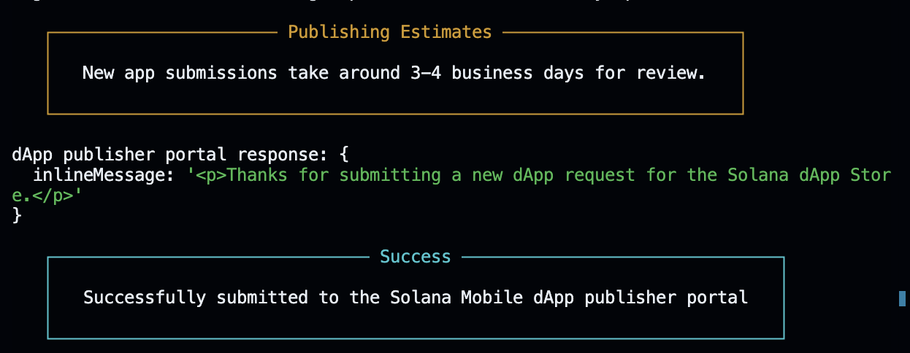

# 🚀 NearMe - Solana dApp Store Release

## 📱 App Information

**App Name:** NearMe - Solana Mobile Payment dApp  
**Version:** 1.0.2 (Latest Update)  
**Package:** com.bluntbrain.NearMe  
**APK Size:** 83MB  
**Initial Release:** August 3, 2024  
**Latest Update:** August 5, 2024  

## 🎯 Release Summary

NearMe has been **successfully submitted** to the Solana dApp Store! This React Native application enables seamless crypto payments at local merchants using Solana blockchain technology, featuring Mobile Wallet Adapter integration, Solana Pay functionality, and NFT reward system.

## 🔗 Blockchain Assets & Links

### 📄 NFT Addresses

| Asset Type | Address | Explorer Link |
|------------|---------|---------------|
| **App NFT** | `5aAgnw5wEDdRXPG1iFDpxDum63e3UmpwiqSBLymEJjqt` | [View on Solana Explorer](https://explorer.solana.com/address/5aAgnw5wEDdRXPG1iFDpxDum63e3UmpwiqSBLymEJjqt?cluster=mainnet) |
| **Release NFT (v1.0.1)** | `56LowjT1m8Pzjgyz4zSA6YXHjjz6hwQhC1oE6yF5fJC4` | [View on Solana Explorer](https://explorer.solana.com/address/56LowjT1m8Pzjgyz4zSA6YXHjjz6hwQhC1oE6yF5fJC4?cluster=mainnet) |
| **Release NFT (v1.0.2)** | `4z5KrFivQmpkjEEFHTVf1jpqf1X3exC1E8xvzVntjjq7` | [View on Solana Explorer](https://explorer.solana.com/address/4z5KrFivQmpkjEEFHTVf1jpqf1X3exC1E8xvzVntjjq7?cluster=mainnet) |
| **Publisher Wallet** | `4fqfqBWhUqUi4YGSY3ETPFP24NKHpmiYtCzEoBzKmzL7` | [View on Solana Explorer](https://explorer.solana.com/address/4fqfqBWhUqUi4YGSY3ETPFP24NKHpmiYtCzEoBzKmzL7?cluster=mainnet) |

### 🔗 Transaction Hashes

| Transaction Type | Hash | Explorer Link |
|------------------|------|---------------|
| **App NFT Creation** | `2B62dp7boNA2o3npmpDMn8LZQKYHk3KdmCsRgoSi5P3FfMx8sYppybp2GfDgAptf84vEQ4MAAzfUNpTRTHFGEDxc` | [View Transaction](https://explorer.solana.com/tx/2B62dp7boNA2o3npmpDMn8LZQKYHk3KdmCsRgoSi5P3FfMx8sYppybp2GfDgAptf84vEQ4MAAzfUNpTRTHFGEDxc?cluster=mainnet) |
| **Release NFT Creation (v1.0.1)** | `65BmuTRVMspXtvCex1KQjtdwiUeCfNg1yFwsdF6qWa5XcWCPri2RTJKKgYgzwoHkJqzE73asm9MmkMXd5ovZE4gW` | [View Transaction](https://explorer.solana.com/tx/65BmuTRVMspXtvCex1KQjtdwiUeCfNg1yFwsdF6qWa5XcWCPri2RTJKKgYgzwoHkJqzE73asm9MmkMXd5ovZE4gW?cluster=mainnet) |
| **Release NFT Creation (v1.0.2)** | `uRQ36S3VJhHAmt4ojxNzdX1xCVnaYoRKsVCeWxpqH5ZaaietqJ8PMy31T8PiiYT8LhgWJtAZjFn84oTMD4esH8y` | [View Transaction](https://explorer.solana.com/tx/uRQ36S3VJhHAmt4ojxNzdX1xCVnaYoRKsVCeWxpqH5ZaaietqJ8PMy31T8PiiYT8LhgWJtAZjFn84oTMD4esH8y?cluster=mainnet) |

## 🖼️ Arweave Asset Links

All app assets have been permanently uploaded to Arweave for decentralized storage:

### 📱 Application Files
- **APK File (v1.0.1):** [NearMe-v1.0.1-production.apk](https://arweave.net/MuI3NPjZg22bvJ-uqG4PisuDkUIX8u6TWWi2Cw0BXhQ)
- **APK File (v1.0.2):** [NearMe-v1.0.2-production.apk](https://arweave.net/Ja9Y0Dj13j1t31IuqW69hGasN9YXSWdq_CuSPX0eQYc)

### 🎨 Visual Assets
- **App Icon:** [storeicon.png](https://arweave.net/1UzEkSJan6Kny3KGj16-vYwSYTdWAWMqrkW8NHo7GCg)
- **Store Icon (Alt):** [storeicon.png](https://arweave.net/tXXDWCRp7KbdLXTu1XKsbQcEshzTad2QsuBy2I7FUr0)
- **Banner Graphic:** [banner.png](https://arweave.net/R2Yp_qg2gU9lGB8D4ggLesJmJE_mgED3tz_KfNRN00M)

### 📸 Screenshots
- **Screenshot 1:** [ScreenShot_01.png](https://arweave.net/Oed1UWb5ge58DcjtkmWwnIFEuq8XSnWw0dZ_AjFI18s)
- **Screenshot 2:** [ScreenShot_02.png](https://arweave.net/FoEOCuds7lXTGzcyGJNvxLb-qLf9k4ELg9_1k37OeCQ)
- **Screenshot 3:** [ScreenShot_03.png](https://arweave.net/l3dyPjlaslNjg7AAUvL_HNw0-wI4c5r_ZTgkHK842Fw)
- **Screenshot 4:** [ScreenShot_04.png](https://arweave.net/0B-CejsSYPTXNAk2ldKhPZ-JKZR2oxz3Eq7HxhBQRHY)
- **Screenshot 5:** [ScreenShot_05.png](https://arweave.net/IZS5RvDsJdwzA0h7_AkHaEfogOlee6KJluB_368SpYE)

## 🏗️ Technical Details

### 🔧 Build Configuration
- **Version Code:** 3 (Updated from 2)
- **Version Name:** 1.0.2 (Updated from 1.0.1)
- **Target SDK:** Android 34
- **Min SDK:** Android 23 (API level 23)
- **Architecture:** arm64-v8a, armeabi-v7a, x86, x86_64
- **Signing:** Custom keystore (`nearme.keystore`)

### 📦 Key Features
- ✅ Mobile Wallet Adapter (MWA) integration
- ✅ Solana Pay functionality
- ✅ Real-time merchant discovery
- ✅ Interactive map with crypto-accepting merchants
- ✅ SOL and USDC payment support
- ✅ 1% SOL cashback rewards
- ✅ NFT reward collection system
- ✅ Firebase real-time database integration
- ✅ Google Places API integration

### 🌐 Supported Networks
- **Primary:** Solana Mainnet
- **Testing:** Solana Devnet

## 📋 Submission Details

### 📝 Store Listing Information
- **Short Description:** "Solana payments & rewards"
- **Category:** Finance & Payments
- **Geographic Focus:** Bangalore, India (expandable)
- **Target Audience:** Crypto enthusiasts, local merchants, mobile payment users

### 🔍 Review Status
- **Initial Submission:** August 3, 2024
- **Update Submitted:** August 5, 2024
- **Status:** Update Under Review
- **Expected Review Time:** 1-2 business days (for updates)
- **Portal Response:** "Thanks for submitting a dApp update request for the Solana dApp Store."

## 🆕 Version 1.0.2 Update Summary

**Released:** August 5, 2024

**What's New:**
- ✅ Enhanced privacy policy and legal documentation
- ✅ Improved store descriptions and feature explanations  
- ✅ Updated repository URLs and licensing information
- ✅ Better compliance with dApp Store guidelines
- ✅ Cleaner, more professional app presentation

**Technical Changes:**
- Updated versionCode: 2 → 3
- Updated versionName: "1.0.1" → "1.0.2"
- New Release NFT: `4z5KrFivQmpkjEEFHTVf1jpqf1X3exC1E8xvzVntjjq7`
- New APK Hash: `VE1xsPnWF2/z5RhBY9CyNJsNRvskawbnWp2lUBHAoBE=`

## 💰 Cost Analysis

| Item | Cost (SOL) | USD Equivalent* |
|------|------------|-----------------|
| App NFT Creation | ~0.02 | ~$0.50 |
| Release NFT Creation | ~0.05 | ~$1.25 |
| Transaction Fees | ~0.01 | ~$0.25 |
| **Total** | **~0.08** | **~$2.00** |

*Based on SOL price at time of submission

## 🔐 Security & Backup

### 🗝️ Publisher Wallet
- **Address:** `4fqfqBWhUqUi4YGSY3ETPFP24NKHpmiYtCzEoBzKmzL7`
- **⚠️ Note:** Private keys and seed phrases are stored securely offline

### 🔒 Signing Certificate
- **Keystore File:** Stored securely for future app updates
- **⚠️ Note:** Required for future app updates and maintained separately

## 📊 Development Metrics

- **Development Time:** 4+ weeks
- **Publishing Pipeline:** 2 hours
- **Lines of Code:** 10,000+ (TypeScript/JavaScript)
- **Dependencies:** 50+ npm packages
- **Firebase Collections:** 3 (merchants, users, transactions)
- **API Integrations:** 4 (Solana RPC, Google Places, Firebase, Arweave)

## 🎯 Next Steps

1. **Monitor Review Process**
   - Check publisher portal for updates
   - Respond to any review feedback promptly

2. **Post-Approval Actions**
   - Announce app availability
   - Begin user acquisition campaigns
   - Monitor app performance and user feedback

3. **Future Updates**
   - Expand to additional cities
   - Add more merchant categories
   - Implement advanced reward mechanics

## 📞 Contact Information

- **Developer:** Ishan Lakhwani
- **Email:** ishan.lakhwani@gmail.com
- **GitHub:** [Krane-Apps/solana-near-me](https://github.com/Krane-Apps/solana-near-me)

## 🏆 Achievement Summary

🎉 **MILESTONE COMPLETED: Successfully published NearMe to Solana dApp Store!**
🚀 **UPDATE MILESTONE: Version 1.0.2 successfully submitted for review!**

This represents a significant achievement in bringing Web3 payments to mainstream mobile users through the official Solana Mobile ecosystem. The app showcases innovative use of:

- Mobile Wallet Adapter for seamless crypto transactions
- Real-time Firebase integration for merchant discovery
- Arweave for permanent asset storage
- Solana blockchain for fast, low-cost payments
- NFT rewards for user engagement

**Version 1.0.2 Update Highlights:**
- Streamlined update process (1-2 business days vs 3-4 for initial)
- Reused existing assets from Arweave (cost-effective)
- Enhanced legal compliance and documentation
- Professional app store presentation

---

*This release and update mark NearMe's mature presence in the Solana Mobile dApp Store ecosystem, with improved compliance and professional presentation making crypto payments accessible to mainstream users in Bangalore and beyond.*